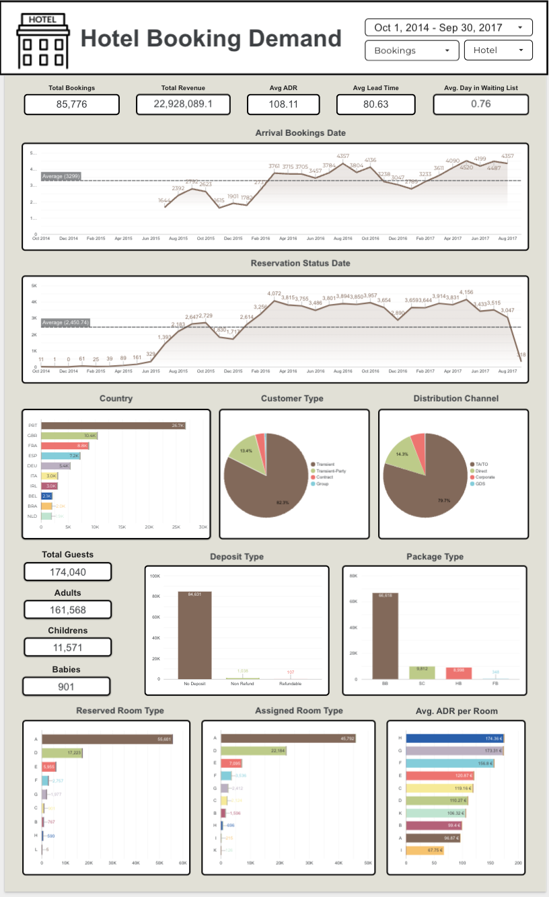

# Hotel Booking Cancellation Prediction Project

## Overview

This project aims to predict hotel booking cancellations using machine learning techniques. The dataset used in this project is from the [Hotel Booking Demand dataset on Kaggle](https://www.kaggle.com/datasets/jessemostipak/hotel-booking-demand/data), which contains hotel booking data from a city hotel in Lisbon and a resort hotel in Algarve, Portugal. The dataset includes various features such as ⁠ lead_time ⁠, ⁠ market_segment ⁠, ⁠ previous_cancellations ⁠, and ⁠ is_canceled ⁠, which are used to build predictive models.

The primary goal of this project is to help hotel management reduce the financial losses caused by booking cancellations by identifying customers who are likely to cancel their reservations. The project involves data cleaning, exploratory data analysis (EDA), feature engineering, and the development of machine learning models to predict cancellations.

## Problem Statement

LisGarve City & Resort Hotel in Portugal is experiencing a significant drop in revenue due to a high rate of booking cancellations. These cancellations are causing financial losses and disrupting hotel operations. The hotel management wants to identify the characteristics of customers who are likely to cancel their bookings and take proactive measures to reduce cancellations.

## Goals

1.⁠ ⁠*Identify Customer Characteristics Likely to Cancel Bookings*: Analyze the data to understand patterns and factors that lead to cancellations.

2.⁠ ⁠*Develop Targeted Marketing Programs*: Create marketing strategies aimed at high-risk customers, such as offering incentives or special deals.

3.⁠ ⁠*Increase Hotel Revenue*: Reduce financial losses due to cancellations by maximizing room occupancy and optimizing revenue management strategies.

## Dataset

The dataset used in this project is from the [Hotel Booking Demand dataset on Kaggle](https://www.kaggle.com/datasets/jessemostipak/hotel-booking-demand/data). It includes 32 columns with information such as:

•⁠  ⁠⁠ hotel ⁠: Type of hotel (City Hotel or Resort Hotel).

•⁠  ⁠⁠ is_canceled ⁠: Whether the booking was canceled (1) or not (0).

•⁠  ⁠⁠ lead_time ⁠: Number of days between the booking date and the arrival date.

•⁠  ⁠⁠ arrival_date_year ⁠: Year of arrival.

•⁠  ⁠⁠ arrival_date_month ⁠: Month of arrival.

•⁠  ⁠⁠ arrival_date_week_number ⁠: Week number of the arrival date.

•⁠  ⁠⁠ arrival_date_day_of_month ⁠: Day of the month of arrival.

•⁠  ⁠⁠ stays_in_weekend_nights ⁠: Number of weekend nights stayed.

•⁠  ⁠⁠ stays_in_week_nights ⁠: Number of weeknights stayed.

•⁠  ⁠⁠ adults ⁠: Number of adults.

•⁠  ⁠⁠ children ⁠: Number of children.

•⁠  ⁠⁠ babies ⁠: Number of babies.

•⁠  ⁠⁠ meal ⁠: Type of meal booked.

•⁠  ⁠⁠ country ⁠: Country of origin of the guest.

•⁠  ⁠⁠ market_segment ⁠: Market segment designation.

•⁠  ⁠⁠ distribution_channel ⁠: Booking distribution channel.

•⁠  ⁠⁠ is_repeated_guest ⁠: Whether the guest is a repeated guest (1) or not (0).

•⁠  ⁠⁠ previous_cancellations ⁠: Number of previous cancellations.

•⁠  ⁠⁠ previous_bookings_not_canceled ⁠: Number of previous bookings not canceled.

•⁠  ⁠⁠ reserved_room_type ⁠: Type of room reserved.

•⁠  ⁠⁠ assigned_room_type ⁠: Type of room assigned.

•⁠  ⁠⁠ booking_changes ⁠: Number of changes made to the booking.

•⁠  ⁠⁠ deposit_type ⁠: Type of deposit made.

•⁠  ⁠⁠ agent ⁠: ID of the travel agency that made the booking.

•⁠  ⁠⁠ company ⁠: ID of the company that made the booking.

•⁠  ⁠⁠ days_in_waiting_list ⁠: Number of days the booking was on the waiting list.

•⁠  ⁠⁠ customer_type ⁠: Type of customer.

•⁠  ⁠⁠ adr ⁠: Average daily rate.

•⁠  ⁠⁠ required_car_parking_spaces ⁠: Number of car parking spaces required.

•⁠  ⁠⁠ total_of_special_requests ⁠: Number of special requests made.

•⁠  ⁠⁠ reservation_status ⁠: Status of the reservation.

•⁠  ⁠⁠ reservation_status_date ⁠: Date of the reservation status.

## Approach

1.⁠ ⁠*Data Collection*: Collect comprehensive hotel booking data, including information such as ⁠ lead_time ⁠, ⁠ market_segment ⁠, ⁠ previous_cancellations ⁠, and ⁠ is_canceled ⁠.

2.⁠ ⁠*Data Cleaning*: Clean the data by handling missing values, outliers, and inconsistencies.

3.⁠ ⁠*Exploratory Data Analysis (EDA)*: Analyze the data to identify patterns, trends, and relationships between variables.

4.⁠ ⁠*Feature Engineering*: Create new features and transform existing ones to improve model performance.

5.⁠ ⁠*Model Development*: Build predictive models using machine learning algorithms such as Logistic Regression, Random Forest, Decision Tree, KNN, Gradient Boosting, XGBoost, and CatBoost.

6.⁠ ⁠*Model Evaluation*: Evaluate model performance using metrics such as accuracy, precision, recall, and F1-score.

7.⁠ ⁠*Deployment and Insights*: Integrate the model into the hotel's reservation system and provide predictive reports to support marketing decisions.

## Machine Learning Models

The following machine learning algorithms are used in this project:

•⁠  ⁠Logistic Regression

•⁠  ⁠Decision Tree Classifier

•⁠  ⁠K-Nearest Neighbors (KNN)

•⁠  ⁠Random Forest Classifier

•⁠  ⁠Gradient Boosting Classifier

•⁠  ⁠HistGradientBoostingClassifier

•⁠  ⁠Voting Classifier (Hard and Soft)

•⁠  ⁠Stacking Classifier

•⁠  ⁠Isolation Forest

•⁠  ⁠XGBoost

•⁠  ⁠CatBoost

## Evaluation Metrics

The primary metric used to evaluate the models is *Recall*, which measures the model's ability to identify customers who are likely to cancel their bookings. Other metrics such as accuracy, precision, and F1-score are also used to assess model performance.

### Confusion Matrix

The confusion matrix is used to evaluate the performance of the classification models. It compares the model's predictions against the actual values.

                      Actual Cancel (1)     Actual Not Cancel (0)
Predicted Cancel (1)      True Positive (TP)      False Positive (FP)
Predicted Not Cancel (0) False Negative (FN)     True Negative (TN)

### Focus on Reducing False Negatives (FN)

In the context of hotel bookings, *False Negatives* have a more significant financial impact because the hotel loses revenue from rooms that could have been resold. Therefore, the primary metric used is *Recall*, which measures how well the model can identify customers who will actually cancel their bookings.

## Business Impact

By focusing on the *Recall* metric, the hotel can minimize *False Negatives* and reduce larger financial losses. The confusion matrix and cost comparison help understand the business impact of booking cancellation predictions.

## Conclusion

This project is designed to assist the management of LisGarve City & Resort Hotel in addressing the significant impact of booking cancellations on revenue and operations. By providing visualizations and insights, the project makes it easier to understand the evaluation metrics and their business implications.

## Requirements

To run this project, you need the following Python libraries:

•⁠  ⁠⁠ numpy ⁠
•⁠  ⁠⁠ pandas ⁠
•⁠  ⁠⁠ matplotlib ⁠
•⁠  ⁠⁠ seaborn ⁠
•⁠  ⁠⁠ missingno ⁠
•⁠  ⁠⁠ scikit-learn ⁠
•⁠  ⁠⁠ catboost ⁠
•⁠  ⁠⁠ xgboost ⁠
•⁠  ⁠⁠ shap ⁠
•⁠  ⁠⁠ imblearn ⁠

## Looker Studio

https://lookerstudio.google.com/reporting/f5702643-aff5-46c9-bbe6-c3db43013ce4

## Deploy Model (Streamlit)

https://gmunfaaer3xfzajh9wm4gm.streamlit.app/
